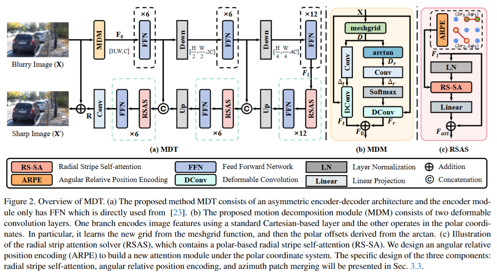

# A Polarization-aided Transformer for Image Deblurring via  Motion Vector Decomposition

This repository provides the official PyTorch implementation of the following paper:

> A Polarization-aided Transformer for Image Deblurring via  Motion Vector Decomposition
>
> Duosheng Chen, Shihao Zhou, Jinshan Pan, Jinglei Shi, Lishen Qu, Jufeng Yang
>
> In CVPR 2025. 
>
<!-- > Paper: https://openaccess.thecvf.com/content/CVPR2023/papers/Kong_Efficient_Frequency_Domain-Based_Transformers_for_High-Quality_Image_Deblurring_CVPR_2023_paper.pdf -->
>
> Abstract: Effectively leveraging motion information is crucial for the image deblurring task. 
Existing methods typically build deep-learning models to restore a clean image by estimating blur patterns over the entire movement. 
This suggests that the blur caused by rotational motion components is processed together with the translational one. 
Exploring the movement without separation leads to limited performance for complex motion deblurring, especially rotational motion. 
In this paper, we propose Motion Decomposition Transformer (MDT), a transformer-based architecture augmented with polarized modules for deblurring via motion vector decomposition. 
MDT consists of a Motion Decomposition Module (MDM) for extracting hybrid rotation and translation features and a Radial Stripe Attention Solver (RSAS) for sharp image reconstruction with enhanced rotational information.
Specifically, the MDM uses a deformable Cartesian convolutional branch to capture translational motion, complemented by a polar-system branch to capture rotational motion. 
The RSAS employs radial stripe windows and angular relative positional encoding in the polar system to enhance rotational information. 
This design preserves translational details while keeping computational costs lower than dual-coordinate design. 
Experimental results on 6 image deblurring datasets show that MDT outperforms state-of-the-art methods, particularly in handling blur caused by complex motions with significant rotational components. 

---

## Contents

The contents of this repository are as follows:

1. [Dependencies](#Dependencies)
2. [Train](#Train)
3. [Test](#Test)

---

## Dependencies

- Python
- Pytorch (1.11)
- scikit-image
- opencv-python
- Tensorboard
- einops

---

---

## Train

bash train.sh

---

## Test

bash test.sh

---

## Acknowledgment: 
This code is based on the [Restormer](https://github.com/swz30/Restormer) and [FFTformer](https://github.com/kkkls/FFTformer)

